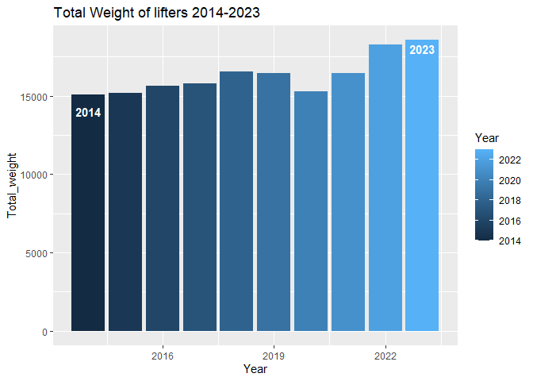

USAPL Powerlifting Mens
================
Paul
2024-03-19

## USAPL Mens Top 10 Powerlifting 2014-2023

Data used to see if there is a difference of USAPL competitors strength
over a set period of time. Data is from USAPL rankings form 2014 to
2023, from OpenPowerlifting. Metrics used for this is the total overall
weight from Squats, Deadlifts and Bench Press.

Preview of the dataset.

``` r
kable(head(USAPL[, 1:9],12), "simple")
```

| Rank | Lifter           | Lifters Weight | Class | Squat | Bench | Deadlift |  Total | Year |
|-----:|:-----------------|---------------:|------:|------:|------:|---------:|-------:|-----:|
|    1 | Kris Hunt        |          198.2 |   198 | 622.8 | 341.7 |    650.3 | 1614.9 | 2014 |
|    2 | Nick Gagnon      |          195.5 |   198 | 562.1 | 380.3 |    606.2 | 1548.7 | 2014 |
|    3 | Ryan Doris       |          194.2 |   198 | 573.2 | 369.2 |    606.2 | 1548.7 | 2014 |
|    4 | Ross Leppala     |          192.9 |   198 | 573.2 | 391.3 |    567.7 | 1532.2 | 2014 |
|    5 | Phillip Spencer  |          198.2 |   198 | 562.1 | 314.1 |    617.3 | 1493.6 | 2014 |
|    6 | Scott Schwartz   |          195.1 |   198 | 529.1 | 341.7 |    622.8 | 1493.6 | 2014 |
|    7 | Carlos Arbalez   |          197.1 |   198 | 556.6 | 347.2 |    578.7 | 1482.6 | 2014 |
|    8 | Justin Martin    |          193.5 |   198 | 523.6 | 330.7 |    617.3 | 1471.6 | 2014 |
|    9 | Lloyd Summers    |          198.4 |   198 | 500.0 | 399.9 |    570.1 | 1470.0 | 2014 |
|   10 | Derek Charlebois |          198.2 |   198 | 501.5 | 363.7 |    578.7 | 1444.0 | 2014 |
|    1 | Shane Brady      |          197.9 |   205 | 578.7 | 402.3 |    622.8 | 1603.8 | 2015 |
|    2 | Rolan Coltherst  |          197.3 |   205 | 556.6 | 374.8 |    628.3 | 1559.7 | 2015 |

Data is organized for the top ten weightlifters by Total Weight of each
exercise, and ranked highest to lowest. Removed any data that was not
for the weight class of 198 and 205(no 198 weight class for 2015-2022,
weight similar to 198 weight class) where the range of a competitors
weight is from 181.81 lbs to 198.40 lbs.

Here is the table created to obtain the sum of total weight for each
lifter by year

``` r
Total_sum <-
  USAPL %>% 
  group_by(Year) %>% 
  summarise(Total_weight=sum(Total))
```

``` r
kable(head(Total_sum,10), "simple")
```

| Year | Total_weight |
|-----:|-------------:|
| 2014 |      15099.9 |
| 2015 |      15200.4 |
| 2016 |      15615.0 |
| 2017 |      15784.7 |
| 2018 |      16523.4 |
| 2019 |      16451.8 |
| 2020 |      15283.1 |
| 2021 |      16423.9 |
| 2022 |      18255.2 |
| 2023 |      18553.7 |

Data shows an increase in total weight lifted for the top lifter in the
198 and 205 weight class over the nine years by 341.7 lbs.

## The Difference Visualized

<!-- -->

Some hypothetical ideas for this being the progression of Sports Science
and powerlifting programs and routines becoming refined to each athlete.

See data collected from here
[link](https://www.openpowerlifting.org/rankings/90/usapl/men/24-34/2014/by-total)
here
[link](https://www.openpowerlifting.org/rankings/90/usapl/men/24-34/2023/by-total)
and here
[link](https://openpowerlifting.gitlab.io/opl-csv/bulk-csv-docs.html)
